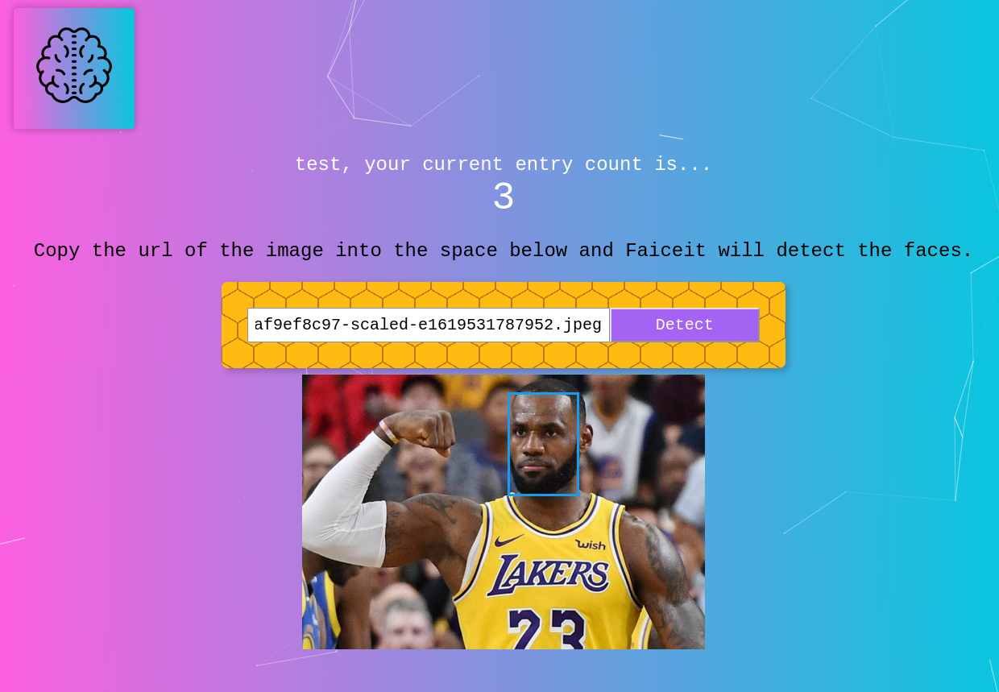

# Faiceit

#### Faiceit is a application that utilizes artificia intelligence to detect human faces. The front end was built with HTML, CSS, and JavaScript + React.js. The backend was built with Node.js, Express.js, PostgreSQL and hosted on Heroku. To demo, either login with credentials email: "test@gmail.com" and password: "test12345" or create an account!

[https://faiceit.herokuapp.com/](https://faiceit.herokuapp.com/)

